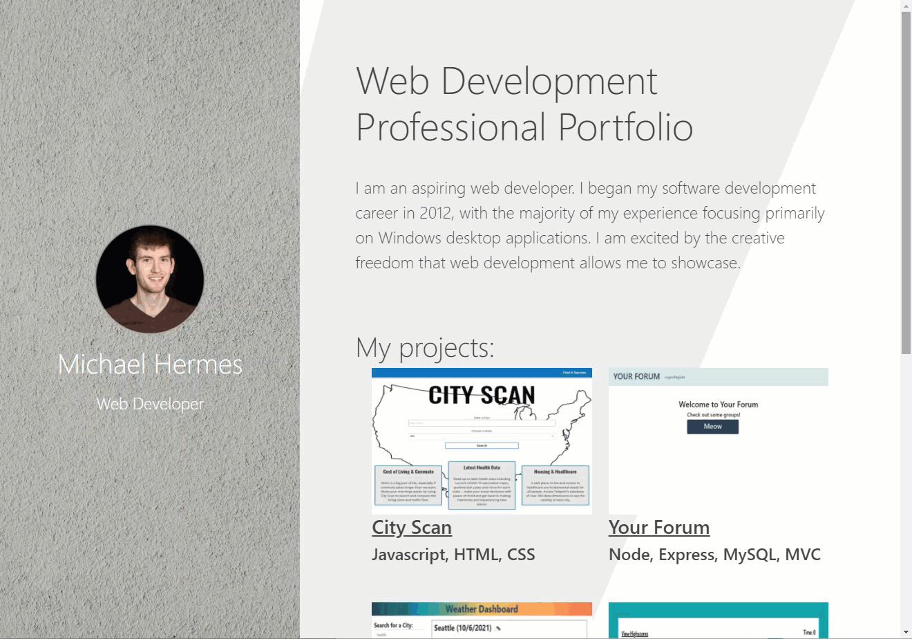

# Michael Hermes' Portfolio

## Description

This is my personal web development portfolio. It contains a showcase of web applications demonstrating the skills, technologies and frameworks I have learned.

## Usage

My portfolio can be found at the following GitHub page: [Michael Hermes' Portfolio](https://michaelhermes.github.io/portfolio/). Click on any of the project images to launch that web page or application.

